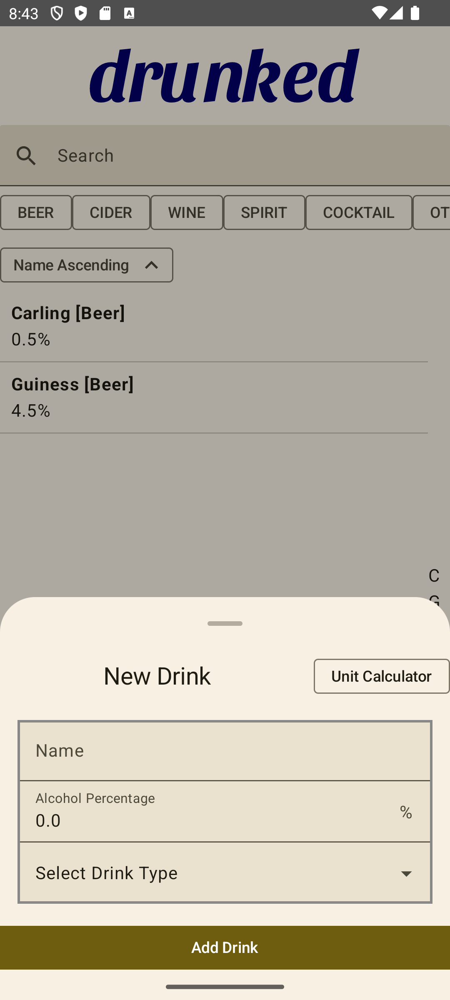
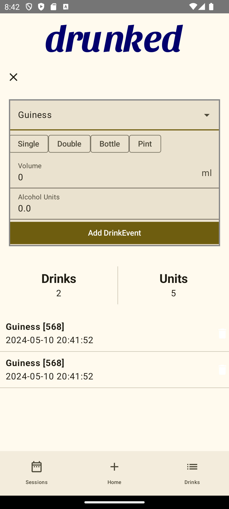
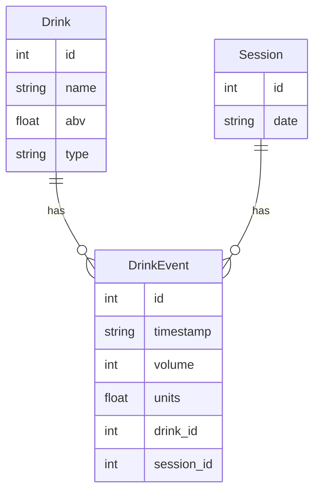

# drunked

A simple app to track your drinking habits.

This is not intended to be used for anything other than mild interest in your drinking habits during a Drinking Session.

## Stack

This is a Kotlin Multiplatform project targeting Android and iOS.

Compose Multiplatform is used for the UI.

ViewModels are used from the Experimental Compose Multiplatform Lifecycle support.

Koin is used for Dependency Injection.

## Database

This app uses SQLDelight for a MultiPlatform SQLLite Database Implementation on Android/iOS.

### ERD

